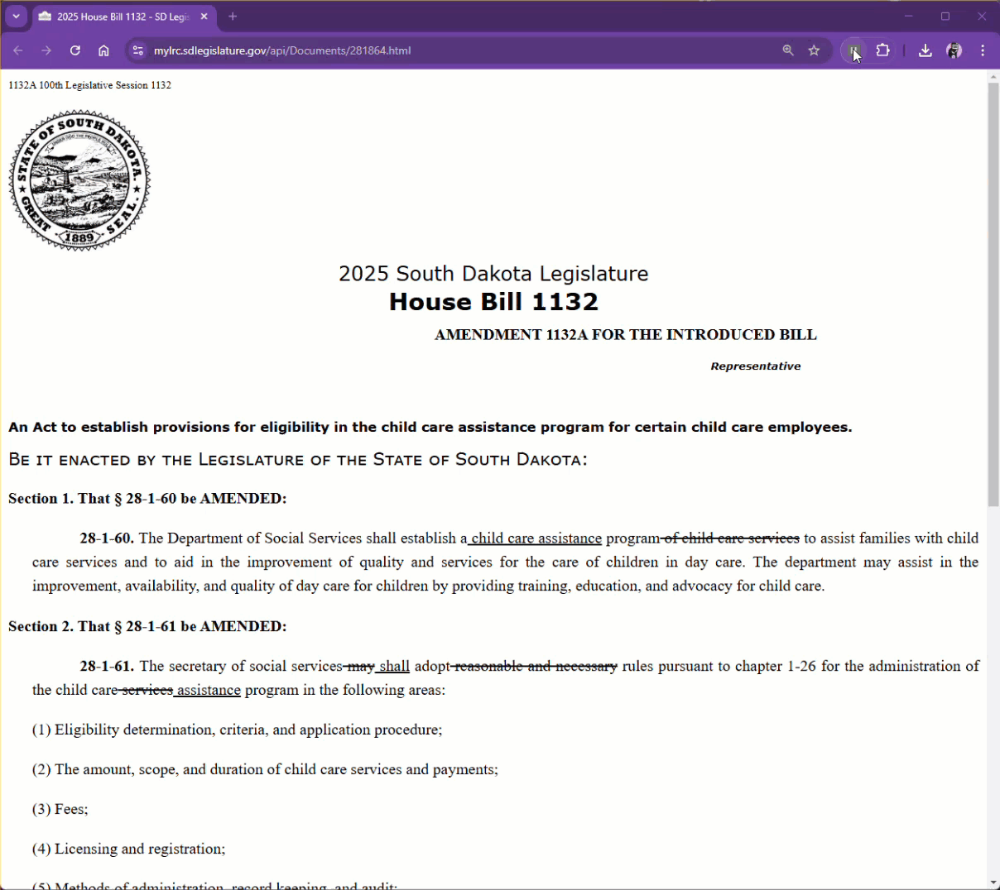

# Toggle Strikethrough Text <!-- omit in toc -->

Legislation can be hard to follow, especially when bills contain extensive strikethrough text for revisions. The Hide Strikethrough Text extension helps simplify South Dakota bills on [https://sdlegislature.gov/](https://sdlegislature.gov/) by allowing you to toggle strikethrough text on and off with a single click.

The legislative process often involves bills being amended 10+ times, leading to cluttered documents filled with strikethrough text that make it hard to quickly see what a bill actually does. I built this tool for my wife, [Nicole](https://www.nicoleforhouse.com), a Representative in the South Dakota State House, to help her cut through the noise and focus on the current version of a bill at a glance. If you work with legislation, I hope this makes your life a little easier too.

If you're in government, advocacy, or just want to better understand legislative changes, I hope this tool helps!  

- [Demo](#demo)
- [Give it a try!](#give-it-a-try)
- [Install the Extension](#install-the-extension)
  - [Part 1: Download the Extension](#part-1-download-the-extension)
  - [Part 2: Enable Developer Mode in Chrome](#part-2-enable-developer-mode-in-chrome)
  - [Part 3: Load the Unpacked Extension](#part-3-load-the-unpacked-extension)
- [Using the Extension](#using-the-extension)

## Demo


## Give it a try!
For examples, after installing the plugin, visit any single .html version of a [2025 State House or Senate Bill](https://sdlegislature.gov/Session/Bills/70) and click the extension. 

## Install the Extension

### Part 1: Download the Extension

1. Click the Code button and select Download ZIP.
2. Extract the downloaded `.zip` file to a location on your computer.

### Part 2: Enable Developer Mode in Chrome

1. Open Google Chrome.
2. In the address bar, type:

```bash
chrome://extensions/
```

and press Enter.

3. In the top-right corner, enable Developer mode (toggle switch).

### Part 3: Load the Unpacked Extension

1. Click Load unpacked in the top-left corner.
2. Select the extracted folder where you downloaded the extension.
3. The extension should now appear in your list of installed extensions.

## Using the Extension

* You should see the extension icon appear in the Chrome toolbar (top-right).
* Click the extension icon to open its functionality.
* If you don’t see the icon, click the puzzle piece (🧩) icon, then pin the extension.
* Follow the extension’s instructions to use its features.

